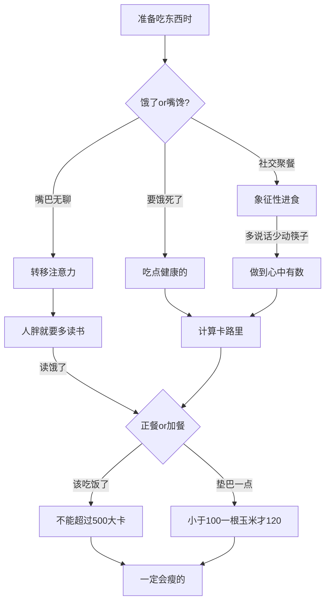

一台机器是不会长胖的

是因为它是严格按照流程做事的

下面是我的体重控制程序流程图，只要我准备吃东西时按照这个流程图走就不会长肉

```mermaid 
graph TD

A[准备吃东西时] --> B{饿了or嘴馋?}
B --> |要饿死了| C[吃点健康的]
B --> |嘴巴无聊| D[转移注意力]
B --> |社交聚餐| J[象征性进食]
C --> E[计算卡路里]
D --> F[人胖就要多读书]
F --> |读饿了| G
E --> G{正餐or加餐}
G --> |该吃饭了| H[不能超过500大卡]
G --> |垫巴一点| I[小于100一根玉米才120]
J --> |多说话少动筷子| K[做到心中有数]
K --> E
H --> L[一定会瘦的]
I --> L

```

